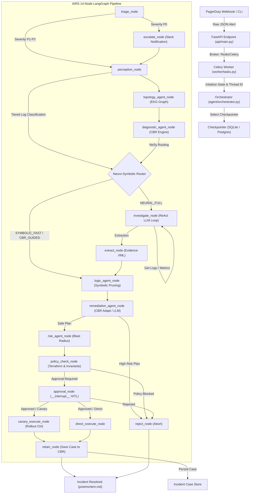
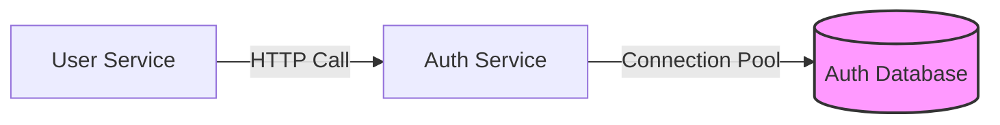

# AIRS Production Architecture

This document details the actual runtime architecture, module responsibilities, control flow, and data flow of the Autonomous Incident Response System (AIRS) based on the production codebase.

---

## 1. System Topology (Mermaid Diagram)



---

## 2. Boot Sequence and Core Execution Control Flow

The runtime lifecycle of an incident remediation is split into three main execution phases:

1. **Ingestion & De-queuing**: The FastAPI endpoint parses the PagerDuty JSON payload, generates a unique transaction `thread_id`, and dispatches it asynchronously to Celery via a Redis broker.
2. **State Construction & Node Routing**: The Celery worker runs `asyncio.run(_run_graph(...))`. The Orchestrator compiles the state machine, restoring previous execution frames from the persistent PostgreSQL or SQLite database using the `thread_id`.
3. **Execution & Checkpointing**: Every node acts as an atomic transaction. Upon completion, the node outputs a partial dict which is merged into `GraphState` and serialized to database storage before the transition edge executes.

---

## 3. Deep Dive: Perception Layer

The Perception Layer is designed to classify high-volume incident records and log payloads before calling reasoning LLMs.

### Tiered Log Classifier (`agent/perception/log_classifier.py`)
To prevent token-limit exhaustion and control API costs, log telemetry goes through a three-tiered inspection system:
* **L1 (Regex Pattern Matcher)**: Fast classification scanning for known patterns like OOM killer logs, database timeout stack traces, and DNS server failures.
* **L2 (TF-IDF Similarity Clustering)**: If L1 fails to extract a clear signature, log structures are transformed into vector spaces using TF-IDF to calculate cosine similarity against known historical error templates.
* **L3 (Few-shot LLM Parsing)**: Highly anomalous messages are routed to a lightweight, low-temperature LLM run to deduce the failure category.

### Perception State Output
The perception node outputs `perception_stats` and `primary_log_template` into `GraphState`:
```python
perception_stats = {
    "L1_hits": int, 
    "L2_hits": int, 
    "L3_hits": int
}
primary_log_template = "connection_pool_exhausted"
```

---

## 4. Deep Dive: Reasoning Layer

The Core Reasoning Layer uses a Hybrid Memory Architecture (HMA) combining deterministic rules, graphs, and neural systems.

### Neuro-Symbolic Router (`agent/reasoning/nesym_router.py`)
This component routes the processing pathway according to the severity, log classification, and historical match confidence:
1. **`SYMBOLIC_FAST`**: Executed if log classification yields a 100% match to known, deterministic failure templates (e.g., expired TLS certificate). It bypasses all neural analysis and generates a hardcoded correction script.
2. **`CBR_GUIDED`**: Executed if the CBR engine yields a cosine similarity score of $\ge 0.8$ against past incident cases. The system adapts the historical remediation steps directly.
3. **`NEURAL_FULL`**: Active when incident logs are anomalous, or when CBR confidence is low. This triggers the agent's full investigative `ReAct` loop, calling external logs and metrics APIs to diagnose the incident.

### Enterprise Knowledge Graph (EKG) (`agent/reasoning/knowledge_graph.py`)
- **No-LLM Graph Traversal**: Queries a Neo4j database (or falls back to an in-memory NetworkX model) representing dependencies between services.
- **Bi-directional Querying**: 
  - *Upstream Query*: What services does the failing service depend on? (Helps find the root cause of cascading failures).
  - *Downstream Query*: What services depend on the failing service? (Calculates the impact scope for blast radius estimation).
  


### Case-Based Reasoning (CBR) Engine (`agent/reasoning/cbr_engine.py`)
The CBR Engine implements continuous learning using four classic steps:
1. **Retrieve**: Converts current telemetry, service tier, and alert descriptions into a unified feature string. It retrieves the top $k$ matches from the database using cosine similarity.
2. **Reuse**: Copies the successful remediation command sequence from the historical precedent case.
3. **Revise**: Using a targeted prompt, the `remediation_agent_node` substitutes runtime variables (e.g., target namespace, pod names) from the current incident into the historical template.
4. **Retain**: If the execution is successful, `retain_node` saves the resolved incident details, telemetry patterns, and outcomes as a new case in the persistent store.

### Logic Agent (Symbolic Hypothesis Pruning) (`agent/nodes.py`)
To prevent LLM hallucination and ensure safety, the Logic Agent applies strict, non-neural logic filters:
- **Nominal Pruning**: Parses metrics retrieved during investigation. If CPU or memory values are beneath nominal thresholds (e.g., CPU utilization is only $35\%$), any hypotheses suggesting CPU bottlenecks or memory leaks are pruned.
- **Topological Inconsistency**: If a dependency indicates a clean health status but a child service claims dependency timeouts, the logic agent adjusts the confidence levels of the cascading failure hypothesis accordingly.

---

## 5. Safe Action & Execution Layer

### Risk Agent & Blast Radius (`agent/action/blast_radius.py`)
Estimates the safety of the proposed rollback or restart commands using EKG node tiers. If the action targets a Tier-1 service (e.g., production database, gateway), the execution strategy is upgraded to `require_approval` or `blocked`.

### Policy-as-Code Engine (`agent/action/policy_engine.py`)
Runs Terraform dry-runs and checks constraints to ensure the generated commands do not violate security compliance (e.g., exposing public SSH ports or deleting stateful volumes).

### Canary & Rollback Controller (`agent/action/canary_controller.py`)
- **Rollout Stages**: Increments traffic routing to corrected pods in stages (e.g., $10\% \rightarrow 50\% \rightarrow 100\%$).
- **Active Rollback**: Compares golden signal snapshots (error rate, latency) against baseline pre-incident telemetry. If metrics degrade, it halts the rollout and executes the `rollback_command`.
- **HITL checkpoint**: If an interrupt is triggered, the state is persisted. A restart command will fetch the saved state and resume exactly at the user approval step.
