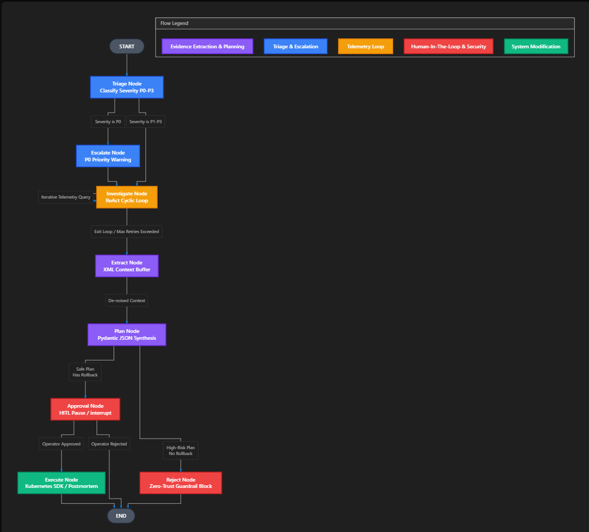

# AIRS Architectural Design

AIRS uses LangGraph to construct a **Directed Cyclic Graph (DCG)** of pure Python functions that represent different stages of an SRE incident response lifecycle.

## The LangGraph State Machine

The core architecture operates on a unified TypedDict State object defined in `agent/state.py`. Each node is a discrete unit of work that receives the State, performs API calls or LLM inference, and returns a dict containing *only* the state fields it modified.

### Graph Nodes
1. **`triage_node`**: Uses structured extraction to determine Severity (`P0`-`P3`) and extract the canonical microservice name.
2. **`escalate_node`**: A zero-trust fast-path. If triage identifies a `P0` incident, execution routes here *before* any tool calls, emitting high-priority alerts to the conversation stream.
3. **`investigate_node`**: A ReAct (Reason + Act) loop. The agent is bound to tools (`get_metrics`, `get_logs`) and accumulates telemetry in the state. 
    - **Circuit Breaker**: A conditional edge checks `retry_count`. If iterations exceed `MAX_RETRIES` (3), the router forces the graph out of the loop to prevent runaway LLM spend.
4. **`extract_node`**: Step 1 of the "Extract-Then-Generate" pipeline. Uses task decomposition and an XML scratchpad (`<extracted_evidence>`) to isolate exact verbatim metrics, error codes, and identifiers from the raw telemetry, mitigating LLM attention bias and hallucination.
5. **`plan_node`**: Step 2 of the "Extract-Then-Generate" pipeline. Synthesizes the XML scratchpad into a highly typed `RemediationPlan` Pydantic model via structured JSON. Evaluates guardrails (e.g., checks if a rollback command was provided).
5. **`approval_node`**: Uses LangGraph's native `interrupt()` primitive. This halts the graph execution entirely and pushes the payload to the external interface (CLI or Slack). Execution remains suspended indefinitely until a `Command(resume=...)` is received.
6. **`execute_node`**: Triggers actual cluster modification using the Kubernetes SDK and compiles the final `postmortem.md`.

## The Adapter Pattern for Production Scale

AIRS is designed to gracefully degrade from Production to Local Mock mode:

- **State Persistence**:
  In local mode, the orchestrator uses `AsyncSqliteSaver`. In production, when `DATABASE_URL` is set, it injects `PostgresSaver`. This allows multiple stateless Celery worker nodes to concurrently process different thread IDs.
  
- **API Tooling**:
  Instead of hardcoding complex Datadog API queries directly into the LLM prompt, we wrap the SDK in `agent/integrations/datadog.py`. The `agent/tools.py` intercepts the LLM's generic query (e.g. `query="db_connections"`) and routes it to either the live Datadog SDK or the FastAPI mock endpoint depending on the presence of `.env` API keys.

## Diagram

